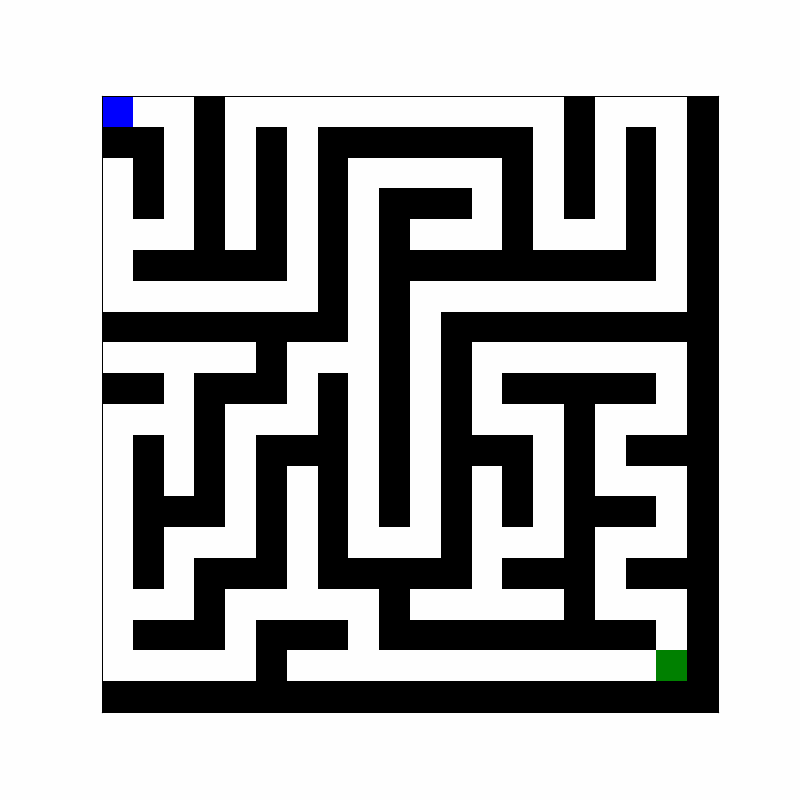

<h1 align="center">📔 Algorithms Project</h1>

A personal journey through computer science – from the most basic to the most advanced algorithms 💻🧠✨

  
  
  

---

## 📚 Table of Contents

| 🚀 Categories                 | 🔗 Link                            |
|-------------------------------|------------------------------------|
| 🔃 Sorting Algorithms         | [Go](#-sorting-algorithms)         |
| 🗃️ Data Structures           | [Go](#-data-structures)            |
| 🔍 Search Algorithms          | [Go](#-search-algorithms)          |
| 🌐 Graph Traversal Algorithms | [Go](#-graph-traversal-algorithms) |
| 🔢 Numerical Algorithms       | [Go](#-numerical-algorithms)       |
| 🧬 Genetic Algorithms         | [Go](#-genetic-algorithms)         |
| 📄 Text Algorithms            | [Go](#-text-algorithms)            |
| 👨🏽‍💻 Author                | [Go](#-author)                     |

---
# 💻 Types of Algorithms

---

## [🔃 Sorting Algorithms](./sortings_algorithms/sort_algorithms.md)

> Algorithms that sort unordered data into a specific order.

These are algorithms that take unordered lists and, after a series of steps, return a sorted list.

### ✅ Implemented

- [`Bogosort`](./sortings_algorithms/bogo_sort.py)  
- [`BogoBogosort`](./sortings_algorithms/bogobogosort.py)  
- [`Bubblesort`](./sortings_algorithms/bubble_sort.py)  
- [`Countingsort`](./sortings_algorithms/counting_sort.py)  
- [`Insertionsort`](./sortings_algorithms/insertion_sort.py)  
- [`Mergesort`](./sortings_algorithms/merge_sort.py)  
- [`Quicksort`](./sortings_algorithms/quick_sort.py)  
- [`Selectionsort`](./sortings_algorithms/selection_sort.py)  
- [`Stalinsort`](./sortings_algorithms/stalin_sort.py)
- [`Radix Sort`](./sortings_algorithms/radix_sort.py)
- [`Heap Sort`](./sortings_algorithms/heapsort.py)
- [`Bucket Sort`](./sortings_algorithms/bucketsort.py)
- [`Shell Sort`](./sortings_algorithms/shell_sort.py)
- [`Tim Sort`](./sortings_algorithms/tim_sort.py)
- [`Pancake Sort`](./sortings_algorithms/pancake_sort.py)

### 🛠️ To Implement
- [ ] `Bitonic Sort`

---

## [🗃️ Data Structures](./data_structures/data_structure.md)
🔙 [Volver a la tabla de contenidos](#-table-of-contents)
> Fundamental for storing and organizing data efficiently. Essential for traversal and search algorithms.

Different data structures that store large amounts of information in various ways. They are essential for many algorithms, such as DFS and BFS, which rely on queues and stacks.

  

### ✅ Implemented:
- [`Binary Tree`](./data_structures/binary_tree.py)  
- [`Double Linked List`](./data_structures/double_linked_list.py)  
- [`Hash Table`](./data_structures/binary_tree.py)  
- [`Linked List`](./data_structures/linked_list.py)
- [`Matrix `](./data_structures/matrix.py)
- [`Queue`](./data_structures/Queue.py)  
- [`Stack`](./data_structures/stack.py)  
- [`Non Directed Graph`](./data_structures/non_directed_graph.py)  
- [`AVL Tree`](./data_structures/avl_tree.py)
- [`Heap`](./data_structures/heap.py)
- [`Trie`](./data_structures/trie.py)

### 🛠️ To implement:

- [ ] `B Tree`
- [ ] `Disjoint Set (Union Find)`
- [ ] `Segment Tree`
- [ ] `Fenwick Tree (Binary Indexed Tree)`

🔙 [Go to Table of Contents](#-table-of-contents)

---

## [🔍 Search Algorithms](search_algorithms/search.md)

🔙 [Go to Table of Contents](#-table-of-contents)

> Locate specific values or solutions within data sets using various strategies.

Search algorithms are those that, through various strategies, locate a value or solution within a dataset.  
They can search for a specific number in a list, a node in a structure like a tree or a graph, or even a point that meets certain conditions.

### ✅Implemented:

- [`Greedy Search Tree`](./search_algorithms/basic_greedy.py)  
- [`Binary Search`](./search_algorithms/binary_search.py)  
- [`Linear Search`](./search_algorithms/lineal_search.py)  
- [`Missing Number`](./search_algorithms/missing_number.py)  
- [`Backtracking`](./search_algorithms/n_queens_backtracking.py)  
- [`Jump Search`](./search_algorithms/jump_search.py)
- [`Exponential Search`](./search_algorithms/exponential_search.py)
- [`Interpolation Search`](./search_algorithms/interpolation_search.py)
- [`Fibonacci Search`](./search_algorithms/fibonacci_search.py)
- [`Ternary Search`](./search_algorithms/ternary_search.py)
### 🛠️ To implement:

- [ ] `Beam Search`
- [ ] `Bidirectional Search`

🔙 [Go to Table of Contents](#-table-of-contents)

---

## [🌐 Graph Traversal Algorithms](graph_traversal_algorithms/) 

🔙 [Go to Table of Contents](#-table-of-contents)

> Explore vertices and edges of graphs to find paths, detect cycles, or analyze structure.

Graph traversal algorithms are used to systematically visit or explore the vertices and edges of a graph.  
They help solve problems like pathfinding, cycle detection, connected component analysis, and shortest path computation.

### ✅ Implemented:

- [`Breadth-First Search (BFS) `](./graph_traversal_algorithms/BFS.py)  
- [`Depth-First Search (DFS)  `](./graph_traversal_algorithms/DFS.py)  
- [`Dijkstra’s Algorithm`](./graph_traversal_algorithms/dijkstra_algorithm.py)  
- [`A* (A Star)`](./graph_traversal_algorithms/Astar.py)
### 🛠️ To implement:

- [ ] `Bellman-Ford`  
- [ ] `Floyd-Warshall`  
- [ ] `Johnson's Algorithm`  
- [ ] `Topological Sort`  
- [ ] `Tarjan's Algorithm`  
- [ ] `Kosaraju's Algorithm`  
- [ ] `Prim's Algorithm`  
- [ ] `Kruskal's Algorithm`  
- [ ] `IDA* (Iterative Deepening A*)`
- [ ] `A* with heuristics`
- [ ] `Edmonds-Karp`
- [ ] `Hierholzer’s Algorithm`

🔙 [Go to Table of Contents](#-table-of-contents)

---

## [🔢 Numerical Algorithms](./numerical_algorithms/numerical.md)

🔙 [Go to Table of Contents](#-table-of-contents)

>  Algorithms that solve numerical problems like root finding or optimization.

They are algorithms that use mathematical methods to find a result, using different tools such as iteration, interpolation, integration... 
These algorithms are key to various branches of engineering and mathematics and are widely used in various fields.

### ✅ Implemented:

- [`binary conversion`](./numerical_algorithms/binary_conversion.py)
- [`bisection method`](./numerical_algorithms/binary_conversion.py)
- [`count ways`](./numerical_algorithms/count_ways.py)
- [`erastothenes sieve`](./numerical_algorithms/erastothenes_sieve.py)
- [`euclides algorithm`](./numerical_algorithms/euclides_algorithm.py)
- [`factorial of a number`](./numerical_algorithms/factorial.py)
- [`fibonacci`](./numerical_algorithms/fibonacci.py)
- [`friendly numbers`](./numerical_algorithms/friendly_numbers.py)
- [`Lucas number`](./numerical_algorithms/lucas_number.py)
- [`max number of an array`](./numerical_algorithms/max_number.py)
- [`min number of an array`](./numerical_algorithms/min_number.py)
- [`mean of a number`](./numerical_algorithms/mean.py)
- [`modular exponentation`](./numerical_algorithms/modular_exponentation.py)
- [`muller method`](./numerical_algorithms/muller_method.py)
- [`Newton Raphson method`](./numerical_algorithms/newton_raphson_method.py)
- [`Pow method`](./numerical_algorithms/pow_method.py)
- [`Regula Falsi Method`](./numerical_algorithms/regulafalsi.py)
- [`Secant method`](./numerical_algorithms/secant_method.py)
- [`Taylor Polinomial`](./numerical_algorithms/taylor_polynomial.py)
- [`Tribonacci`](./numerical_algorithms/tribonacci.py)
- [`Cholesky Descomposition`](./numerical_algorithms/cholesky_decomposition.py)
- [`Gauss Jordan Elimination`](./numerical_algorithms/gauss_jordan_elimination.py)

### 🛠️ To implement

- [ ] `Gauss Jordan Elimination`
- [ ] `QR Descomposition`
- [ ] `Brent's Method`
- [ ] `Fixed Point Iteration`
- [ ] `Lagrange Polynomial Interpolation`
- [ ] `Spline Interpolation`
- [ ] `Fourier Series`
- [ ] `Standart Deviation and Variance`
- [ ] `Gradient Descent`
- [ ] `Runge-Kutta Methods`
- [ ] `Nash Balance`
- [ ] `K-Means`
- [ ] `Montecarlo's Algorithm`
- [ ] `LU Decomposition`
- [ ] `Gauss-Seidel Iteration`
- [ ] `Simpson's Rule`
- [ ] `Conjugate Gradient Method`

🔙 [Go to Table of Contents](#-table-of-contents)

---

## [🧬 Genetic Algorithms](./genetic_algorithms/genetic_algorithms.md)

🔙 [Go to Table of Contents](#-table-of-contents)

> Heuristic search inspired by natural selection: selection, crossover, mutation.

Algorithms are algorithms that are based on organised steps to arrive at the solution of a specific problem. These algorithms are based on evolving populations of individuals by subjecting them to a series of random actions until a solution is reached. Similar to how evolution works.

### ✅ Implemented

- [`Mutation`](./genetic_algorithms/mutation.py)
- [`One Point Crossover`](./genetic_algorithms/one_point_crossover.py)
- [`Two Point Crossover`](./genetic_algorithms/two_point_crossover.py)
- [`Uniform Crossover`](./genetic_algorithms/uniform_crossover.py)
- [`Sudoku Example`](./genetic_algorithms/sudoku.py)
- [`Fitness Proportional Selection`](./genetic_algorithms/Roulete_wheel.py)
- [`Tournament Selection`](./genetic_algorithms/tournament_selection.py)
- [`Elitism`](./genetic_algorithms/elitism.py)
- [`Multiobjective Optimization (NSGA-II)`](./genetic_algorithms/nsgaii.py)
- [`Gene encoding Tecniques`]() 
  - [`Binary Genome Representation`](./genetic_algorithms/binary_genome_representation_generator.py)
  - [`Real Genome Representation`](./genetic_algorithms/Real_Genome_Representation.py)
  - [`Permutation Genome Representation`](./genetic_algorithms/Permutation_Genome_Representation.py)

- [`Dynamic Mutation Rate`](./genetic_algorithms/dynamic_mutation_rate.py)
- [`Real Valued Genetic Algorithm`](./genetic_algorithms/real_valued_genetic_algorithm.py)
- [`Simulated Annealing`](./genetic_algorithms/simulated_annealing.py)

### 🛠️ To implement

- [ ] `Hybrid GA + Local Search (Memetic Algorithm)`
- [ ] `Differential Evolution`

🔙 [Go to Table of Contents](#-table-of-contents)

---

## [📄 Text Algorithms](./text_algorithms/text.md)

🔙 [Go to Table of Contents](#-table-of-contents)

>Algorithms that manipulate, analyze, and transform sequences of characters.

Text algorithms include techniques for searching and matching patterns in text (like KMP or Rabin-Karp), compressing data (such as Huffman or LZ77), and encoding/decoding strings (e.g., Base64 or Unicode). They are essential in applications like text editors, search engines, file compressors, communication protocols, and natural language processing.

### ✅ Implemented

- [`Caesar Encoding`](./text_algorithms/cesar_codex.py)
-  [`Huffman Algorithm`](./text_algorithms/huffman.py)
- [`vigenere encoding`](./text_algorithms/vigenere_codex.py)
- [`Rabin-Karp`](./text_algorithms/rabin_karp_algorithm.py)
### 🛠️ To implement

- [ ] ` Knuth-Morris-Pratt (KMP)`
- [ ] `Boyer-Moore`
- [ ] ` LZ77 / LZ78 Compression`
- [ ] ` Run-Length Encoding (RLE)`
- [ ] ` Base64 Encoding`
- [ ] ` ASCII / Unicode Conversion`
- [ ] ` ROT13`
- [ ] ` Edit Distance (Levenshtein)`
- [ ] ` Anagram Checker`
- [ ] ` Trie Construction`
- [ ] ` Regex-based Pattern Matching`
- [ ] `Burrows-Wheeler Transfom`
- [ ] `Suffix Array`
- [ ] `Aho-Corasick Automaton`

🔙 [Go to Table of Contents](#-table-of-contents)

## 🧪 Real-World Use Cases
🔙 [Go to Table of Contents](#-table-of-contents)

> Here's a collection of practical applications for each algorithm, organized by type and real-world context.

| 🧠 **Algorithm**              | 📂 **Type**             | 🔍 **Real-World Application**                                                       |
|------------------------------|-------------------------|--------------------------------------------------------------------------------------|
| Bogosort                     | Sorting                 | Educational joke to explain inefficient algorithms.                                 |
| Bubblesort                   | Sorting                 | Teaching sorting basics to beginners or children.                                   |
| Mergesort                    | Sorting                 | Splitting and merging large datasets, external file sorting.                        |
| Quicksort                    | Sorting                 | Sorting products by price in e-commerce.                                            |
| Countingsort                 | Sorting                 | Grade distribution for exams (integers 0-100).                                      |
| Heap Sort                    | Sorting                 | Priority queue sorting (e.g. scheduling tasks).                                     |
| Radix Sort                   | Sorting                 | Sorting bank account numbers or ZIP codes.                                          |
| Bucket Sort                  | Sorting                 | Grouping scores or age ranges efficiently.                                          |
| Shell Sort                   | Sorting                 | Sorting nearly sorted datasets more efficiently.                                    |
| Binary Tree                  | Data Structure          | Menu hierarchies, expression parsing.                                               |
| Stack                        | Data Structure          | Undo/Redo operations in editors.                                                    |
| Queue                        | Data Structure          | Customer service waiting lines.                                                     |
| Linked List                  | Data Structure          | Music playlist navigation or memory allocation.                                     |
| Hash Table                   | Data Structure          | Fast key-value lookups (e.g. caches, DNS resolution).                               |
| Matrix                       | Data Structure          | Game boards, maps, and image processing.                                            |
| AVL Tree                     | Data Structure          | Balanced index trees in databases.                                                  |
| Heap                         | Data Structure          | Event simulation, task schedulers.                                                  |
| Trie                         | Data Structure          | Autocomplete search systems.                                                        |
| Linear Search                | Search                  | Searching an unsorted contact list.                                                 |
| Binary Search                | Search                  | Looking up words in a dictionary.                                                   |
| Interpolation Search         | Search                  | Finding a value with linear distribution (e.g. in surveys).                         |
| Fibonacci Search             | Search                  | Large list searches to minimize access comparisons.                                 |
| Greedy Search Tree           | Search                  | Approximate pathfinding in maps.                                                    |
| Backtracking (N-Queens)      | Search                  | Solving Sudoku or constraint-based puzzles.                                         |
| Jump Search                  | Search                  | Searching faster in sorted data blocks.                                             |
| DFS                          | Graph                   | Exploring all possible paths in a maze.                                             |
| BFS                          | Graph                   | Finding shortest path in unweighted graphs (e.g. social networks).                  |
| Dijkstra                     | Graph                   | GPS route finding in road networks.                                                 |
| A*                           | Graph                   | Game AI pathfinding with heuristics.                                                |
| Bellman-Ford                 | Graph                   | Finding shortest paths with negative edge weights.                                  |
| Floyd-Warshall               | Graph                   | All-pairs shortest path in transport networks.                                      |
| Kruskal                      | Graph                   | Designing low-cost wiring or power grids.                                           |
| Prim                         | Graph                   | Network cable layout with minimal total cost.                                       |
| Tarjan / Kosaraju            | Graph                   | Detecting circular dependencies in software modules.                                |
| Topological Sort             | Graph                   | Task scheduling with prerequisites (e.g. courses).                                  |
| Newton-Raphson               | Numerical               | Finding roots in physics and engineering equations.                                 |
| Bisection Method             | Numerical               | Solving nonlinear equations with known sign change.                                 |
| Modular Exponentiation       | Numerical               | Used in RSA and Diffie-Hellman cryptographic systems.                               |
| Eratosthenes Sieve           | Numerical               | Generating prime numbers for security applications.                                 |
| Euclidean Algorithm          | Numerical               | Simplifying fractions, computing GCD in encryption.                                 |
| Taylor Polynomial            | Numerical               | Function approximation in physics simulations.                                      |
| Gauss Jordan                 | Numerical               | Solving systems of linear equations.                                                |
| Spline Interpolation         | Numerical               | Curve fitting in animations or robotics.                                            |
| Runge-Kutta                  | Numerical               | Simulating physical systems (e.g. pendulums, circuits).                             |
| Monte Carlo Method           | Numerical               | Risk analysis, financial modeling, AI simulations.                                  |
| Gradient Descent             | Numerical               | Optimizing machine learning models.                                                 |
| K-Means                      | Numerical               | Customer segmentation and image compression.                                        |
| Mutation                     | Genetic                 | Introducing variability in evolutionary solutions.                                  |
| Crossover (1P, 2P, Uniform)  | Genetic                 | Combining features from parents in simulations.                                     |
| NSGA-II                      | Genetic                 | Multi-objective optimization (e.g. time vs cost).                                   |
| Tournament Selection         | Genetic                 | Evolutionary fitness selection (AI, simulations).                                   |
| Elitism                      | Genetic                 | Preserving best candidates during evolution.                                        |
| Genetic Sudoku               | Genetic                 | Solving Sudoku puzzles with evolutionary search.                                    |
| Caesar Cipher                | Text                    | Simple message encryption.                                                          |
| Vigenère Cipher              | Text                    | Basic polyalphabetic cipher for secure messages.                                    |
| Huffman Encoding             | Text                    | Compressing files using character frequency.                                        |
| Rabin-Karp                   | Text                    | Fast pattern search in long texts (e.g. plagiarism detection).                      |
| KMP                          | Text                    | Efficient text searching with pattern preprocessing.                                |
| LZ77 / LZ78                  | Text                    | File compression in ZIP and PNG formats.                                            |
| Base64 Encoding              | Text                    | Encoding binary data for email or URLs.                                             |
| Levenshtein Distance         | Text                    | Spelling correction and fuzzy matching.                                             |
| Anagram Checker              | Text                    | Word games or search engines.                                                       |
| Regex Matching               | Text                    | Validating emails, passwords, or complex text inputs.                               |

🔙 [Go to Table of Contents](#-table-of-contents)

*(Coming soon)*

---

## 🧑🏽‍💻 Author

- [@lumusa2design](https://github.com/lumusa2design)

  

