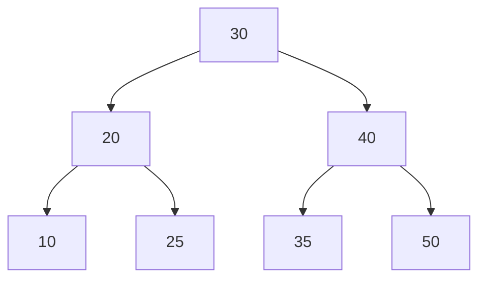
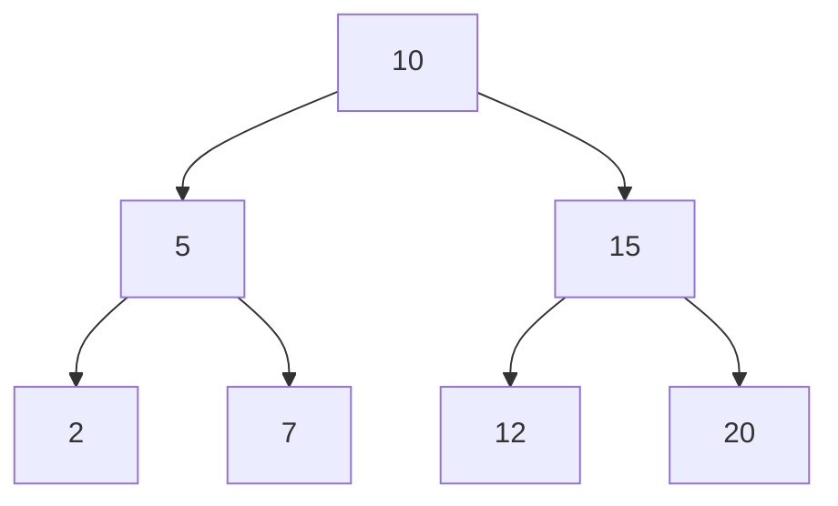

<h1 align="center"> 📁 Data structures </h1>

## What is a Data Structure?

In computer science, a **data structure** is a specialized format for organizing, processing, retrieving, and storing data efficiently.  
They are the building blocks of efficient algorithms, since the choice of the right structure can significantly improve performance in terms of **time** and **memory usage**.

---
## 📚 Categories of Data Structures

Data structures can be broadly classified into two categories:


- **Linear Data Structures**
    
    Data is  arranged in a sequential manner.
    
  *examples*: `Arrays` , `Linked Lists`, `Stacks`, `Queues`
- **Non-Linear Data Structures**

    Data is not stored sequentially, but hierarchically or with complex relationships.

    *Examples*: `Trees`, `Graphs`, `Hash Tables`

## 💡 Why are Data Structures Important?

- Optimize **searching**
- Enable efficient **memory management**
- Provide reusable components for solving complex problems

## Data Structures in this repository

- [Avl Tree](./avl_tree.py)
- [Binary Tree](./binary_tree.py)
- [Linked List](./linked_list.py)
- [Double Linked List](./double_linked_list.py)
- [hash table](./hash_table.py)
- [heap](./heap.py)
- [matrix](./matrix.py)
- [node](./node.py)
- [non directed graph](./non_directed_graph.py)
- [Queue](./Queue.py)
- [Stack](./stack.py)
- [trie](./trie.py)


## Explanation of the data structures

### 🌲 AVL TREE

> *Is a Self-Balanced Binary Search Tree*

An **AVL Tree** is a type of **Binary Search Tree (*BST*)** where the height of the left and right subtrees of any 
node differ by at most **1**.

This property ensures that the tree remains approximately balanced, guaranteeing efficient operations.

#### ✅ Key properties:

- Every node has a **balance factor** = `height(left) - height(right)`
- Balance factor can be only -1, 0, +1
- If the balance factor goes outside this range, rotations makes balance.

#### 🔄 Rotation Cases

- Single Right Rotation (LL Case)
- Single Left Rotation (RR Case)
- Left-Right Rotation (LR Case)
- Right-Left Rotation (RL Case)

#### ⏱ Time Complexity

- Search:  ***O(log n)***
- Insertion: ***O(log n)***
- Deletion: ***O(log n)***



---
#### 👨🏼‍💻Code view
**Specialized Node to an AVL- Tree**:
```python
class AVL_Node(Node):
    def __init__(self, value, left = None, right=None, parent=None):
        super().__init__(value, left, right)
        self.parent = parent
        self.height = 1
```
Here, the Node class is extended to include height and a pointer to the parent.

**Definition of an AVL-Tree:**

```python
class AVL_Tree:
    def __init__(self):
        self.root = None
        self.length = 0
```

First definition of a  void AVL Tree


**Height and balance functions:**

```python
    def get_height(self, node):
        return node.height if node else 0
    def update_height(self, node):
        node.height = 1 + max(self.get_height(node.left),self.get_height(node.right))
    def get_balance_factor(self, node):
        return self.get_height(node.left) - self.get_height(node.right)
```
These functions allow you to detect whether a node is unbalanced, i.e., its balance factor is outside the range of 1, 0, -1.

basic rotation:
```python
    def rotate_left(self, root_node):
        new_root = root_node.right
        orphan_subtree = new_root.left

        new_root.left, root_node.right = root_node, orphan_subtree
        new_root.parent, root_node.parent = root_node.parent, new_root
        if orphan_subtree:
            orphan_subtree.parent = root_node

        if new_root.parent is None:
            self.root = new_root
        else:
            if new_root.parent.left is root_node:
                new_root.parent.left = new_root
            else:
                new_root.parent.right = new_root

        self.update_height(root_node)
        self.update_height(new_root)

        return new_root

    def rotate_right(self, root_node):
        new_root = root_node.left
        orphan_subtree = new_root.right

        new_root.right = root_node
        root_node.left = orphan_subtree

        new_root.parent = root_node.parent
        root_node.parent = new_root
        if orphan_subtree:
            orphan_subtree.parent = root_node

        if new_root.parent is None:
            self.root = new_root
        else:
            if new_root.parent.left is root_node:
                new_root.parent.left = new_root
            else:
                new_root.parent.right = new_root

        self.update_height(root_node)
        self.update_height(new_root)

        return new_root

```


### 🌲 Binary Tree

> *Is a hierarchical data structure in which each node has at most two children, referred to as the left child and the right child.*

A **Binary Tree** is one of the most fundamental data structures in computer science.  
It organizes data in a hierarchical structure where each node can have:  
- A **left child**  
- A **right child**  
- Or no children (leaf node)
---
#### ✅ Key Properties:
- The maximum number of children per node is **2**.  
- The depth of a binary tree with `n` nodes can vary between `log₂(n)` (best case, balanced) and `n` (worst case, skewed).  
- Traversals are commonly performed in different orders:  
  - **Inorder** (Left → Root → Right)  
  - **Preorder** (Root → Left → Right)  
  - **Postorder** (Left → Right → Root)  
  - **Level-order** (Breadth-First Search)

---

---

#### ⏱️ Time Complexity (general case):
- Search: **O(n)** (O(log n) if balanced)  
- Insertion: **O(n)** (O(log n) if balanced)  
- Deletion: **O(n)** (O(log n) if balanced)  

---



*(coming soon)*