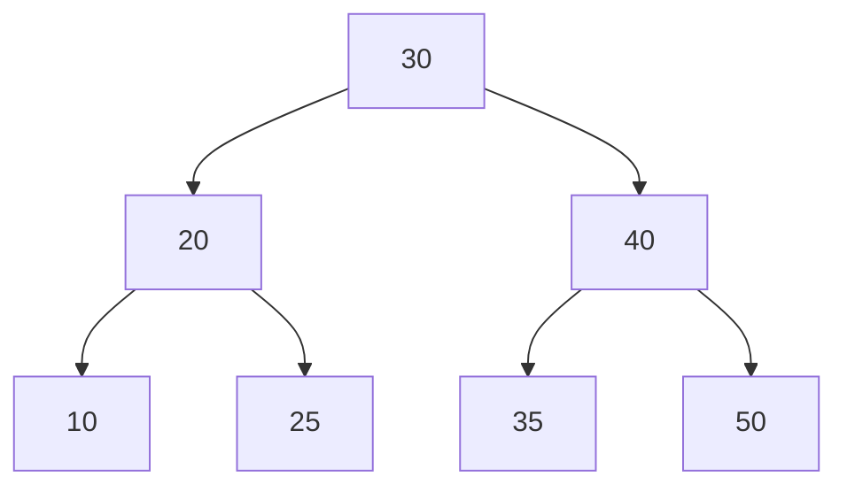
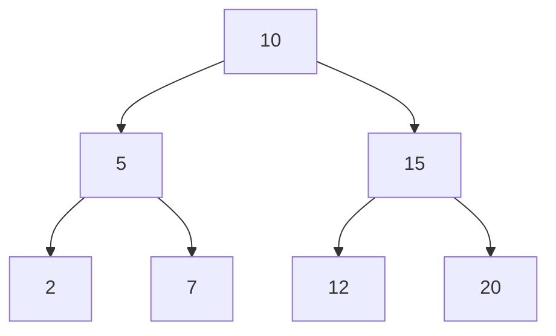
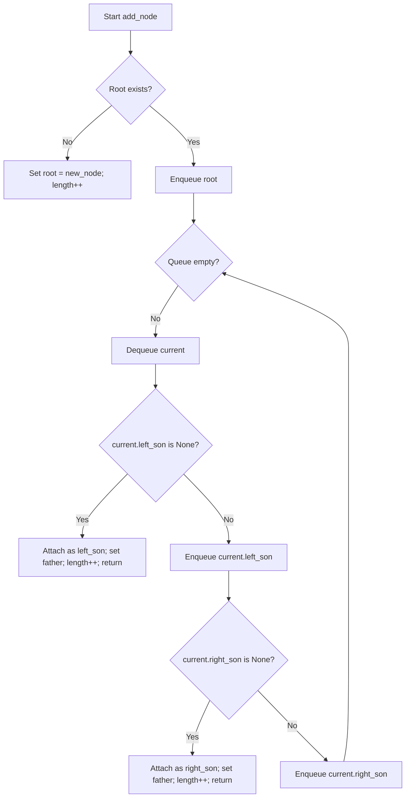

<h1 align="center"> 📁 Data structures </h1>

## What is a Data Structure?

In computer science, a **data structure** is a specialized format for organizing, processing, retrieving, and storing data efficiently.  
They are the building blocks of efficient algorithms, since the choice of the right structure can significantly improve performance in terms of **time** and **memory usage**.

---
## 📚 Categories of Data Structures

Data structures can be broadly classified into two categories:


- **Linear Data Structures**
    
    Data is  arranged in a sequential manner.
    
  *examples*: `Arrays` , `Linked Lists`, `Stacks`, `Queues`
- **Non-Linear Data Structures**

    Data is not stored sequentially, but hierarchically or with complex relationships.

    *Examples*: `Trees`, `Graphs`, `Hash Tables`

## 💡 Why are Data Structures Important?

- Optimize **searching**
- Enable efficient **memory management**
- Provide reusable components for solving complex problems

## Data Structures in this repository

- [Avl Tree](./avl_tree.py)
- [Binary Tree](./binary_tree.py)
- [Linked List](./linked_list.py)
- [Double Linked List](./double_linked_list.py)
- [hash table](./hash_table.py)
- [heap](./heap.py)
- [matrix](./matrix.py)
- [node](./node.py)
- [non directed graph](./non_directed_graph.py)
- [Queue](./Queue.py)
- [Stack](./stack.py)
- [trie](./trie.py)


## Explanation of the data structures

### 🌲 [AVL TREE](./avl_tree.py)

> *Is a Self-Balanced Binary Search Tree*

An **AVL Tree** is a type of **Binary Search Tree (*BST*)** where the height of the left and right subtrees of any 
node differ by at most **1**.

This property ensures that the tree remains approximately balanced, guaranteeing efficient operations.

#### ✅ Key properties:

- Every node has a **balance factor** = `height(left) - height(right)`
- Balance factor can be only -1, 0, +1
- If the balance factor goes outside this range, rotations makes balance.

#### 🔄 Rotation Cases

- Single Right Rotation (LL Case)
- Single Left Rotation (RR Case)
- Left-Right Rotation (LR Case)
- Right-Left Rotation (RL Case)

#### ⏱ Time Complexity

- Search:  ***O(log n)***
- Insertion: ***O(log n)***
- Deletion: ***O(log n)***



---
#### 👨🏼‍💻Code view
**Specialized Node to an AVL- Tree**:
```python
class AVL_Node(Node):
    def __init__(self, value, left = None, right=None, parent=None):
        super().__init__(value, left, right)
        self.parent = parent
        self.height = 1
```
Here, the Node class is extended to include height and a pointer to the parent.

**Definition of an AVL-Tree:**

```python
class AVL_Tree:
    def __init__(self):
        self.root = None
        self.length = 0
```

First definition of a  void AVL Tree


**Height and balance functions:**

```python
    def get_height(self, node):
        return node.height if node else 0
    def update_height(self, node):
        node.height = 1 + max(self.get_height(node.left),self.get_height(node.right))
    def get_balance_factor(self, node):
        return self.get_height(node.left) - self.get_height(node.right)
```
These functions allow you to detect whether a node is unbalanced, i.e., its balance factor is outside the range of 1, 0, -1.

basic rotation:
```python
    def rotate_left(self, root_node):
        new_root = root_node.right
        orphan_subtree = new_root.left

        new_root.left, root_node.right = root_node, orphan_subtree
        new_root.parent, root_node.parent = root_node.parent, new_root
        if orphan_subtree:
            orphan_subtree.parent = root_node

        if new_root.parent is None:
            self.root = new_root
        else:
            if new_root.parent.left is root_node:
                new_root.parent.left = new_root
            else:
                new_root.parent.right = new_root

        self.update_height(root_node)
        self.update_height(new_root)

        return new_root

    def rotate_right(self, root_node):
        new_root = root_node.left
        orphan_subtree = new_root.right

        new_root.right = root_node
        root_node.left = orphan_subtree

        new_root.parent = root_node.parent
        root_node.parent = new_root
        if orphan_subtree:
            orphan_subtree.parent = root_node

        if new_root.parent is None:
            self.root = new_root
        else:
            if new_root.parent.left is root_node:
                new_root.parent.left = new_root
            else:
                new_root.parent.right = new_root

        self.update_height(root_node)
        self.update_height(new_root)

        return new_root

```
**Rebalance**
```python
    def rebalance(self, node):
        self.update_height(node)
        balance_factor = self.get_balance_factor(node)
        if balance_factor > 1 and self.get_balance_factor(node.left) >= 0:
            return self.rotate_right(node)
        if balance_factor > 1 and self.get_balance_factor(node.left) < 0:
            node.left = self.rotate_left(node.left)
            node.left.parent = node
            return self.rotate_right(node)
        if balance_factor < -1 and self.get_balance_factor(node.right) <= 0:
            return self.rotate_left(node)
        if balance_factor < -1 and self.get_balance_factor(node.right) > 0:
            node.right = self.rotate_right(node.right)
            node.right.parent = node
            return self.rotate_left(node)
        return node
```


Here we can see the four types of rotation of an AVL-Tree:

- **LL**: Right Rotation
- **RR**: Left Rotation
- **LR**: Left Rotation + Right Rotation
- **RL**: Right Rotation + Left Rotation


**Insert a Node**
```python
    def insert(self, value):
        if self.root is None:
            self.root = AVL_Node(value)
            self.size = 1
            return

        def _insert(current_node, value):
            if current_node is None:
                self.size += 1
                return AVL_Node(value)

            if value < current_node.value:
                new_child = _insert(current_node.left, value)
                if current_node.left is not new_child:
                    current_node.left = new_child
                    new_child.parent = current_node
            elif value > current_node.value:
                new_child = _insert(current_node.right, value)
                if current_node.right is not new_child:
                    current_node.right = new_child
                    new_child.parent = current_node
            else:
                return current_node

            return self.rebalance(current_node)

        self.root = _insert(self.root, value)
        self.root.parent = None
```

Inserts a Node like a Binary Search Tree but, then uses the balance function  recursively to get a balanced tree


**Basic User's Operations**

- Search:
```python
    def search(self, value):
        current_node = self.root
        while current_node:
            if value == current_node.value:
                return current_node
            elif value < current_node.value:
                current_node = current_node.left
            else:
                current_node = current_node.right
        return None
```
Search a specific node in the tree

- In order tree traversal:
```python
    def inorder_traversal(self):
        result = []
        def _inorder(node):
            if not node:
                return
            _inorder(node.left)
            result.append(node.value)
            _inorder(node.right)
        _inorder(self.root)
        return result

```


### 🌲 Binary Tree

> *Is a hierarchical data structure in which each node has at most two children, referred to as the left child and the right child.*

A **Binary Tree** is one of the most fundamental data structures in computer science.  
It organizes data in a hierarchical structure where each node can have:  
- A **left child**  
- A **right child**  
- Or no children (leaf node)
---
#### ✅ Key Properties:
- The maximum number of children per node is **2**.  
- The depth of a binary tree with `n` nodes can vary between `log₂(n)` (best case, balanced) and `n` (worst case, skewed).  
- Traversals are commonly performed in different orders:  
  - **Inorder** (Left → Root → Right)  
  - **Preorder** (Root → Left → Right)  
  - **Postorder** (Left → Right → Root)  
  - **Level-order** (Breadth-First Search)

---

---

#### ⏱️ Time Complexity (general case):
- Search: **O(n)** (O(log n) if balanced)  
- Insertion: **O(n)** (O(log n) if balanced)  
- Deletion: **O(n)** (O(log n) if balanced)  

---




### 👨🏼‍💻 Code Review

**Basic Node with pointers to parens and childs**

```python
class Node:
    def __init__(self, value):
        self.father = None
        self.left_son = None
        self.right_son = None
        self.value = value
```

First define the node of a tree with:

- ***self.value***: stored data.
- ***self.father*** : node's father reference.
- ***left_son, right_son*** : references to the left and right children.

Having the pointer to the parent makes it easier to perform operations such as deleting, rotating, or moving up the tree without having to retrace the path from the root.

**Tree initialize**

```python
class BinaryTree:
    def __init__(self, first_value=None):
        if first_value is None:
            self.root = None
            self.length = 0
        else:
            self.root = Node(first_value)
            self.length = 1
```

Allows you to create the tree empty or with an initial value.

- If there is a `first_value`, create the `root` node and set `length` to 1
- else, leave the `root` as None and `length` is 0

This provides a quick way to create a tree with an initial element without having to call add_node afterwards.

**Level Order insertion**

```python
    def add_node(self, value):
        new_node = Node(value)
        if not self.root:
            self.root = new_node
            self.length += 1
            return

        q = Queue.Queue()
        q.enqueue(self.root)

        while not q.is_empty():
            current = q.dequeue()

            if not current.left_son:
                current.left_son = new_node
                new_node.father = current
                self.length += 1
                return
            else:
                q.enqueue(current.left_son)

            if not current.right_son:
                current.right_son = new_node
                new_node.father = current
                self.length += 1
                return
            else:
                q.enqueue(current.right_son)

```


1- If the tree is empty, the new node becomes the root.

2- If not, use a queue to perform a BFS:
  - Extract `current`.
  - If `current.left_son` is free, insert there and finish.
  - If not, queue left child
  - If `current.right_son is free`, insert there and finish
  - If not, queue the right child.

3- Increment length when inserting.



### use example

```python
binary_tree = BinaryTree()

for node in [10,20,30,40,50]:
    binary_tree.add_node(node)
```


---
### ⛓ Double linked List
> Is a linear data structure consisting of nodes, where each node has references to both its previous and next node.

A **Double Linked List (DLL)** is an extension of a **Linked List**, where each node contains two pointers: one to the **previous node** and one to the **next node**.

This Bidirectional nature makes insertions and deletions more flexible compared to a singly linked list.

---
### ✅ Key Properties


- each node has:
  -  `value`: the stored data
  - `prev_node`: pointer to the previous node.
  - `next_node`: pointer to the next node.
- The list has pointers to the **first** to the **last** node.
- Can be traversed in **both directions**
- Easier to remove a node when you already have a pointer to it

---

### 🔧 Core Operations
- **Insertions**: New elements are usually added at the end (*O(1)*).
- **Search by position**: Traverses nodes until reaching the index (*O(n)*).
- **Deletion by position**: Re-links neighbors and updates head/tail if necessary (*O(n)*).
- **Traversal**:Forward or backward (*O(n)*).

### ⏱ Time Complexity


*(coming soon)*