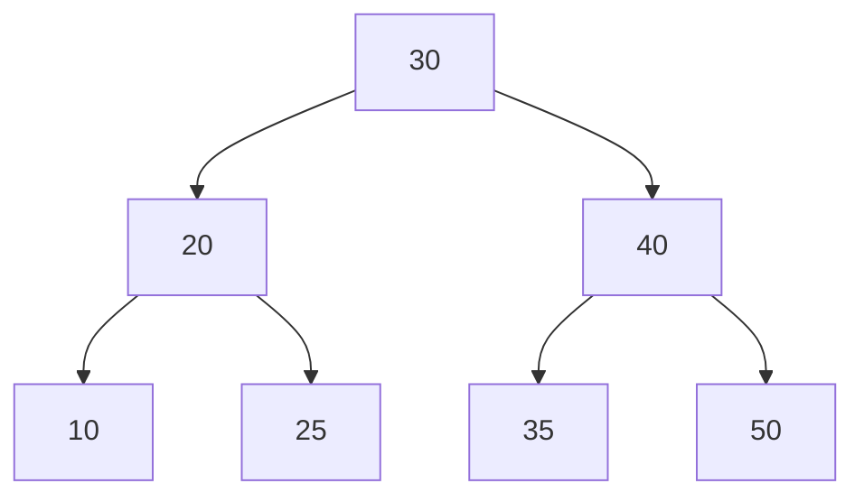

<h1 align="center"> 📁 Data structures </h1>

## What is a Data Structure?

In computer science, a **data structure** is a specialized format for organizing, processing, retrieving, and storing data efficiently.  
They are the building blocks of efficient algorithms, since the choice of the right structure can significantly improve performance in terms of **time** and **memory usage**.

---
## 📚 Categories of Data Structures

Data structures can be broadly classified into two categories:

- **Linear Data Structures**
    
    Data is  arranged in a sequential manner.
    
  *examples*: `Arrays` , `Linked Lists`, `Stacks`, `Queues`
- **Non-Linear Data Structures**

    Data is not stored sequentially, but hierarchically or with complex relationships.

    *Examples*: `Trees`, `Graphs`, `Hash Tables`

## 💡 Why are Data Structures Important?

- Optimize **searching**
- Enable efficient **memory management**
- Provide reusable components for solving complex problems

## Data Structures in this repository

- [Avl Tree](./avl_tree.py)
- [Binary Tree](./binary_tree.py)
- [Linked List](./linked_list.py)
- [Double Linked List](./double_linked_list.py)
- [hash table](./hash_table.py)
- [heap](./heap.py)
- [matrix](./matrix.py)
- [node](./node.py)
- [non directed graph](./non_directed_graph.py)
- [Queue](./Queue.py)
- [Stack](./stack.py)
- [trie](./trie.py)

## Explanation of the data structures

### 🌲 AVL TREE

> *Is a Self-Balanced Binary Search Tree*

An **AVL Tree** is a type of **Binary Search Tree (*BST*)** where the height of the left and right subtrees of any 
node differ by at most **1**.

This property ensures that the tree remains approximately balanced, guaranteeing efficient operations.

#### ✅ Key properties:

- Every node has a **balance factor** = `height(left) - height(right)`
- Balance factor can be only -1, 0, +1
- If the balance factor goes outside this range, rotations makes balance.

#### 🔄 Rotation Cases

- Single Right Rotation (LL Case)
- Single Left Rotation (RR Case)
- Left-Right Rotation (LR Case)
- Right-Left Rotation (RL Case)

#### ⏱ Time Complexity

- Search:  ***O(log n)***
- Insertion: ***O(log n)***
- Deletion: ***O(log n)***

*(coming soon)*