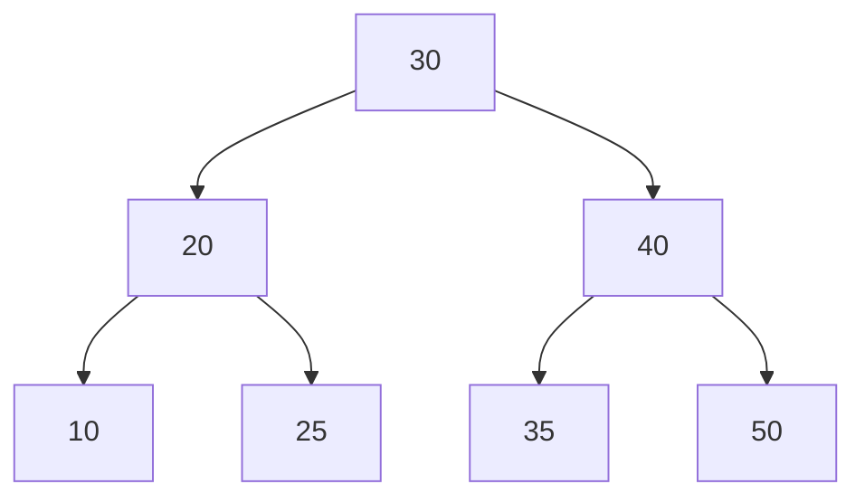
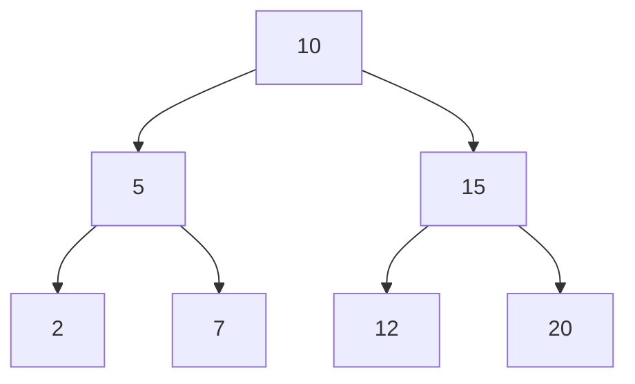
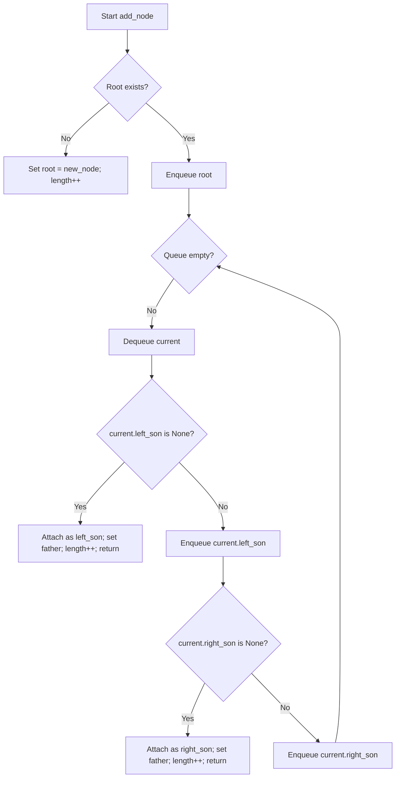
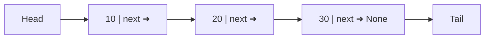
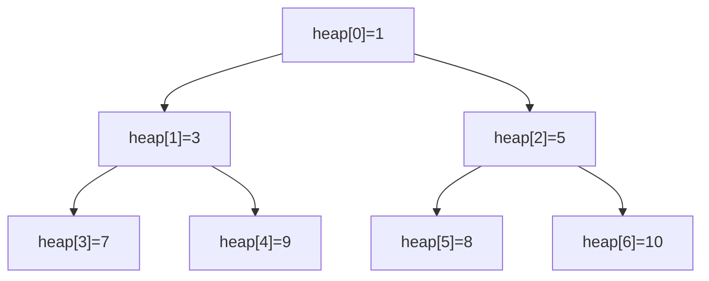

<h1 align="center"> 📁 Data structures </h1>

## What is a Data Structure?

In computer science, a **data structure** is a specialized format for organizing, processing, retrieving, and storing data efficiently.  
They are the building blocks of efficient algorithms, since the choice of the right structure can significantly improve performance in terms of **time** and **memory usage**.

---
## 📚 Categories of Data Structures

Data structures can be broadly classified into two categories:


- **Linear Data Structures**
    
    Data is  arranged in a sequential manner.
    
  *examples*: `Arrays` , `Linked Lists`, `Stacks`, `Queues`
- **Non-Linear Data Structures**

    Data is not stored sequentially, but hierarchically or with complex relationships.

    *Examples*: `Trees`, `Graphs`, `Hash Tables`

## 💡 Why are Data Structures Important?

- Optimize **searching**
- Enable efficient **memory management**
- Provide reusable components for solving complex problems

## Data Structures in this repository

- [Avl Tree](./avl_tree.py)
- [Binary Tree](./binary_tree.py)
- [Linked List](./linked_list.py)
- [Double Linked List](./double_linked_list.py)
- [hash table](./hash_table.py)
- [heap](./heap.py)
- [matrix](./matrix.py)
- [node](./node.py)
- [non directed graph](./non_directed_graph.py)
- [Queue](./Queue.py)
- [Stack](./stack.py)
- [trie](./trie.py)


## Explanation of the data structures

## 🌲 [AVL TREE](./avl_tree.py)

> *Is a Self-Balanced Binary Search Tree*

An **AVL Tree** is a type of **Binary Search Tree (*BST*)** where the height of the left and right subtrees of any 
node differ by at most **1**.

This property ensures that the tree remains approximately balanced, guaranteeing efficient operations.

#### ✅ Key properties:

- Every node has a **balance factor** = `height(left) - height(right)`
- Balance factor can be only -1, 0, +1
- If the balance factor goes outside this range, rotations makes balance.

#### 🔄 Rotation Cases

- Single Right Rotation (LL Case)
- Single Left Rotation (RR Case)
- Left-Right Rotation (LR Case)
- Right-Left Rotation (RL Case)

#### ⏱ Time Complexity

- Search:  ***O(log n)***
- Insertion: ***O(log n)***
- Deletion: ***O(log n)***



---
#### 👨🏼‍💻Code view
**Specialized Node to an AVL- Tree**:
```python
class AVL_Node(Node):
    def __init__(self, value, left = None, right=None, parent=None):
        super().__init__(value, left, right)
        self.parent = parent
        self.height = 1
```
Here, the Node class is extended to include height and a pointer to the parent.

**Definition of an AVL-Tree:**

```python
class AVL_Tree:
    def __init__(self):
        self.root = None
        self.length = 0
```

First definition of a  void AVL Tree


**Height and balance functions:**

```python
    def get_height(self, node):
        return node.height if node else 0
    def update_height(self, node):
        node.height = 1 + max(self.get_height(node.left),self.get_height(node.right))
    def get_balance_factor(self, node):
        return self.get_height(node.left) - self.get_height(node.right)
```
These functions allow you to detect whether a node is unbalanced, i.e., its balance factor is outside the range of 1, 0, -1.

basic rotation:
```python
    def rotate_left(self, root_node):
        new_root = root_node.right
        orphan_subtree = new_root.left

        new_root.left, root_node.right = root_node, orphan_subtree
        new_root.parent, root_node.parent = root_node.parent, new_root
        if orphan_subtree:
            orphan_subtree.parent = root_node

        if new_root.parent is None:
            self.root = new_root
        else:
            if new_root.parent.left is root_node:
                new_root.parent.left = new_root
            else:
                new_root.parent.right = new_root

        self.update_height(root_node)
        self.update_height(new_root)

        return new_root

    def rotate_right(self, root_node):
        new_root = root_node.left
        orphan_subtree = new_root.right

        new_root.right = root_node
        root_node.left = orphan_subtree

        new_root.parent = root_node.parent
        root_node.parent = new_root
        if orphan_subtree:
            orphan_subtree.parent = root_node

        if new_root.parent is None:
            self.root = new_root
        else:
            if new_root.parent.left is root_node:
                new_root.parent.left = new_root
            else:
                new_root.parent.right = new_root

        self.update_height(root_node)
        self.update_height(new_root)

        return new_root

```
**Rebalance**
```python
    def rebalance(self, node):
        self.update_height(node)
        balance_factor = self.get_balance_factor(node)
        if balance_factor > 1 and self.get_balance_factor(node.left) >= 0:
            return self.rotate_right(node)
        if balance_factor > 1 and self.get_balance_factor(node.left) < 0:
            node.left = self.rotate_left(node.left)
            node.left.parent = node
            return self.rotate_right(node)
        if balance_factor < -1 and self.get_balance_factor(node.right) <= 0:
            return self.rotate_left(node)
        if balance_factor < -1 and self.get_balance_factor(node.right) > 0:
            node.right = self.rotate_right(node.right)
            node.right.parent = node
            return self.rotate_left(node)
        return node
```


Here we can see the four types of rotation of an AVL-Tree:

- **LL**: Right Rotation
- **RR**: Left Rotation
- **LR**: Left Rotation + Right Rotation
- **RL**: Right Rotation + Left Rotation


**Insert a Node**
```python
    def insert(self, value):
        if self.root is None:
            self.root = AVL_Node(value)
            self.size = 1
            return

        def _insert(current_node, value):
            if current_node is None:
                self.size += 1
                return AVL_Node(value)

            if value < current_node.value:
                new_child = _insert(current_node.left, value)
                if current_node.left is not new_child:
                    current_node.left = new_child
                    new_child.parent = current_node
            elif value > current_node.value:
                new_child = _insert(current_node.right, value)
                if current_node.right is not new_child:
                    current_node.right = new_child
                    new_child.parent = current_node
            else:
                return current_node

            return self.rebalance(current_node)

        self.root = _insert(self.root, value)
        self.root.parent = None
```

Inserts a Node like a Binary Search Tree but, then uses the balance function  recursively to get a balanced tree


**Basic User's Operations**

- Search:
```python
    def search(self, value):
        current_node = self.root
        while current_node:
            if value == current_node.value:
                return current_node
            elif value < current_node.value:
                current_node = current_node.left
            else:
                current_node = current_node.right
        return None
```
Search a specific node in the tree

- In order tree traversal:
```python
    def inorder_traversal(self):
        result = []
        def _inorder(node):
            if not node:
                return
            _inorder(node.left)
            result.append(node.value)
            _inorder(node.right)
        _inorder(self.root)
        return result

```


## [🌲 Binary Tree](./binary_tree.py)

> *Is a hierarchical data structure in which each node has at most two children, referred to as the left child and the right child.*

A **Binary Tree** is one of the most fundamental data structures in computer science.  
It organizes data in a hierarchical structure where each node can have:  
- A **left child**  
- A **right child**  
- Or no children (leaf node)
---
### ✅ Key Properties:
- The maximum number of children per node is **2**.  
- The depth of a binary tree with `n` nodes can vary between `log₂(n)` (best case, balanced) and `n` (worst case, skewed).  
- Traversals are commonly performed in different orders:  
  - **Inorder** (Left → Root → Right)  
  - **Preorder** (Root → Left → Right)  
  - **Postorder** (Left → Right → Root)  
  - **Level-order** (Breadth-First Search)

---

---

### ⏱️ Time Complexity (general case):
- Search: **O(n)** (O(log n) if balanced)  
- Insertion: **O(n)** (O(log n) if balanced)  
- Deletion: **O(n)** (O(log n) if balanced)  

---




### 👨🏼‍💻 Code Review

**Basic Node with pointers to parens and childs**

```python
class Node:
    def __init__(self, value):
        self.father = None
        self.left_son = None
        self.right_son = None
        self.value = value
```

First define the node of a tree with:

- ***self.value***: stored data.
- ***self.father*** : node's father reference.
- ***left_son, right_son*** : references to the left and right children.

Having the pointer to the parent makes it easier to perform operations such as deleting, rotating, or moving up the tree without having to retrace the path from the root.

**Tree initialize**

```python
class BinaryTree:
    def __init__(self, first_value=None):
        if first_value is None:
            self.root = None
            self.length = 0
        else:
            self.root = Node(first_value)
            self.length = 1
```

Allows you to create the tree empty or with an initial value.

- If there is a `first_value`, create the `root` node and set `length` to 1
- else, leave the `root` as None and `length` is 0

This provides a quick way to create a tree with an initial element without having to call add_node afterwards.

**Level Order insertion**

```python
    def add_node(self, value):
        new_node = Node(value)
        if not self.root:
            self.root = new_node
            self.length += 1
            return

        q = Queue.Queue()
        q.enqueue(self.root)

        while not q.is_empty():
            current = q.dequeue()

            if not current.left_son:
                current.left_son = new_node
                new_node.father = current
                self.length += 1
                return
            else:
                q.enqueue(current.left_son)

            if not current.right_son:
                current.right_son = new_node
                new_node.father = current
                self.length += 1
                return
            else:
                q.enqueue(current.right_son)

```


1- If the tree is empty, the new node becomes the root.

2- If not, use a queue to perform a BFS:
  - Extract `current`.
  - If `current.left_son` is free, insert there and finish.
  - If not, queue left child
  - If `current.right_son is free`, insert there and finish
  - If not, queue the right child.

3- Increment length when inserting.



### use example

```python
binary_tree = BinaryTree()

for node in [10,20,30,40,50]:
    binary_tree.add_node(node)
```


---
## ⛓ [Double linked List](./double_linked_list.py)
> Is a linear data structure consisting of nodes, where each node has references to both its previous and next node.

A **Double Linked List (DLL)** is an extension of a **Linked List**, where each node contains two pointers: one to the **previous node** and one to the **next node**.

This Bidirectional nature makes insertions and deletions more flexible compared to a singly linked list.

---
### ✅ Key Properties


- each node has:
  -  `value`: the stored data
  - `prev_node`: pointer to the previous node.
  - `next_node`: pointer to the next node.
- The list has pointers to the **first** to the **last** node.
- Can be traversed in **both directions**
- Easier to remove a node when you already have a pointer to it

---

### 🔧 Core Operations
- **Insertions**: New elements are usually added at the end (*O(1)*).
- **Search by position**: Traverses nodes until reaching the index (*O(n)*).
- **Deletion by position**: Re-links neighbors and updates head/tail if necessary (*O(n)*).
- **Traversal**:Forward or backward (*O(n)*).

### ⏱ Time Complexity
| Operation              |  Average  |  Worst Case  |
|------------------------|:---------:|:------------:|
| Search                 |  *O(n)*   |    *O(n)*    |
| Insertion(end)         |  *O(1)*   |    *O(1)*    |
| Deletion (by position) |  *O(n)*   |    *O(n)*    |
| Traversal              |  *O(n)*   |    *O(n)*    |


### 👨🏼‍💻 Code Review:
**Double Pointer Node:**

```python
class Node:
    def __init__(self, value, position):
        self.prev_node = None
        self.next_node = None
        self.value = value
        self.position = position

    def __str__(self):
        return f'{self.value}'
```

Elements of this node:
- `prev_node`: pointer to the previous node.
- `next_node`: pointer to the next node.
- `value`: stored data.
- `position`: assigned index at the insertion time.
- `__str__*`: prints the value of the node.

**List initialize:**
```python
class DoubleLinkedList:
    def __init__(self, first_node=None):
        if first_node is None:
            self.first_node = None
            self.last_node = None
            self.length = 0
        else:
            self.first_node = Node(first_node, 0)
            self.last_node = self.first_node
            self.length = 1
```

- If not initial valued is recieved → initialise as an empty list
- else: `first_node` is received → initialise with a single node(`first node` and `last node` point the same node).

**add nodes to the end:**

```python
    def add_node(self, new_node):
        if self.first_node is None:
            self.first_node = Node(new_node, 0)
            self.last_node = self.first_node
            self.length = 1
            return
        node = Node(new_node, self.length)
        self.last_node.next_node = node
        node.prev_node = self.last_node
        self.last_node = node
        self.length += 1
```

- if the list is empty, create the first node
- else, create a new node and link to the end
  - `last_node.next_node` points to the new node.
  - the new node points back (`prev_node` = `last_node`)
  - update `last_node` and increase `length`

this makes always get a Polynomial time of *O(1)*.

**Search by postion**
```python
    def find_node_by_position(self, position):
        if position < 0 or position >= self.length:
            raise IndexError("index out of range")
        actual = self.first_node
        for _ in range(position):
            actual = actual.next_node
        return actual
```

1. Search the index
2. Go through the list from the top down.

Complexity of *O(n)* in the worst case

**Delete by position**

```python
    def remove_node_by_position(self, position):
        if position < 0 or position >= self.length:
            raise IndexError("index out of range")
        to_remove = self.find_node_by_position(position)
        prev_n = to_remove.prev_node
        next_n = to_remove.next_node

        if prev_n:
            prev_n.next_node = next_n
        else:
            self.first_node = next_n

        if next_n:
            next_n.prev_node = prev_n
        else:
            self.last_node = prev_n

        self.length -= 1
        return to_remove.value
```

1. Find the node to delete
2. Reconnect the pointers of the `prev_node` or `last_node`
3. if is the first one or the last one, update `first_node` or `last_node`.
4. Decrease `length`.

**auxiliar methods**

***length***

```python
def __len__(self):
    return self.length
```

returns the length of the linked list

***str***
```python
    def __str__(self):
        if self.length == 0 or self.first_node is None:
            return "List is empty"
        valores = []
        actual = self.first_node
        while actual:
            valores.append(str(actual.value))
            actual = actual.next_node
        return " <-> ".join(valores)
```

Returns a visual representation of the list, linked by arrows.

### Use example

```python
double_linked_list = DoubleLinkedList()
double_linked_list.add_node(10)
double_linked_list.add_node(20)
double_linked_list.add_node(30)

print(double_linked_list) 
double_linked_list.remove_node_by_position(1)
print(double_linked_list)  
print(len(double_linked_list))  

```

## ⛓ [Simple linked list](./linked_list.py)

> A Linked List is a linear data structure made of nodes, where each node stores a value and a reference to the next node.

A **linked list** stores elements in nodes connected by references. Unlike an array, it does not require contiguous memory and allows efficient insertions/deletions without moving many elements.

### ✅ Key Properties

- Each *node* stores:
  -  `value`: the data.
  - `next`: pointer to the next node.
- Only one direction traversal (from head to tail).
- No fixed capacity (grows dynamically).
- Access by index is sequential.

### 🔧 Common Operations

- **add_node(value):** append at the end.
- **find_node_by_position:** access node by index.
- **remove_node_by_position:** remove node at index.
- **insert_by_position:** insert an element at index.
- **len:** returns the current size.
- **print:** retrn a string of the values.

### ⏱ Time Complexity

| Operation             | Average | Worst Case |
|-----------------------|:-------:|:----------:|
| Access by index       | *O(n)*  |   *O(n)*   |
| Search by value       | *O(n)*  |   *O(n)*   |
| Insertion at end      | *O(1)*  |   *O(1)*   |
| Insertion at position | *O(n)*  |   *O(n)*   |
| Deletion at position  | *O(n)*  |   *O(N)*   |



### 👨🏼‍💻 Code Visualization

**Node**

```python
class Node:
    def __init__(self, value, position=0):
        self.value = value
        self.next_node = None
        self.position = position

    def __str__(self):
        return f'{self.value}'
```

- Holds `value`, a pointer `next_node`, and its `position`.
- `position` is maintained by the list for convenience but requieres reordering after modifications.


**Initialization**

```python
class Simple_Linked_List:
    def __init__(self, first_node):
        self.first_node = Node(first_node)
        self.len = 1
        self.last_node = self.first_node
```

- Creates a new node and attaches it to the **end** of the list.
- Updates `last_nodes` for *O(1)* append time

**Find by Position**

```python
def find_node_by_position(self, position):
    if position < 0 or position > self.len:
        pass
    actual = self.first_node
    for i in range(position):
        actual = actual.next_node
    return actual
```

- Traverses from the head until reaching the target index.

**Remove node by position**
```python
def remove_node_by_position(self, position):
    self.len -= 1
    if position == 0:
        if self.first_node == self.last_node:
            self.last_node = None
            self.first_node = None
        else:
            self.first_node = self.first_node.next_node
    else:
        actual = self.first_node
        for i in range(position -1):
            actual = actual.next_node
        next_node = actual.next_node
        actual.next_node = next_node.next_node

        self.reorder()
```

Remove a node by position.


**Reorder**

```python
def reorder(self):
    position = 0
    actual = self.first_node
    while actual is not None:
        actual.position = position
        actual = actual.next_node
        position += 1
    self.last_node = self.find_node_by_position(self.len - 1) if self.len > 0 else None
```

- Renumbers positions after insertions/deletions.
- Updates `last_nodes` to remain consistent.

**Insert by Position (not finished)**
```python
def insert_by_position(self, position, value):
    if position > self.len:
        return "is not so big"
    for i in range(position -1):
        print(i)

```
 
**Utilities**
```python
def __str__(self):
    actual = self.first_node
    list_str = ""
    while actual is not None:
        list_str += str(actual) + ", "
        actual = actual.next_node
    return list_str.strip(", ")

```

**String** representation, prints the values separated by commas.

```python
def __len__(self):
    return self.len

```

Allow know length of the list directly.

## 🗻 [Heap](./heap.py)

first,  in my repo I have implemented the data structure "min-heap" because is the most used in the programming industry.

> A Min-Heap is a complete binary tree where each node is less than or equal to its children. The minimum element is always at the root.

A **Min-Heap** stores elements in an array while conceptually representing a complete binary tree. It supports fast retrieval/removal of the minimum and efficient insertions thanks to bubble-up and sink operations that maintain the heap property.

### ✅ Key Properties

- `parent` ≤ `children` 
- **Complete binary tree:** compact, filled level by level from left to right.
- **Array Representation:**
  - `parent(i)` = (i - 1)//2
  - `left(i)` = 2*i + 1
  - `right(i)` = 2*i + 2

### 🔧 Core Operations

- **insert(x):** append to array, then **bubble up** to restore order.
- **extract:** remove root (min), move last to root, then **sink down**.
- **peek:** return current minimum without removal.

### ⏱ Time Complexity

| Operation                   |  Average   |    Worst    |
|-----------------------------|:----------:|:-----------:|
| **peek**                    |   *O(1)*   |   *O(1)*    |
| **insert**                  | *O(log n)* | *O (log n)* |
| **extract**                 | *O(log n)* | *O(log n)*  |
| **build-heap from n items** |   *O(n)*   |   *O(n)*    |




### 👨🏼‍💻 Code review

**Structure and auxiliar helpers**

```python
class Heap:
    def __init__(self):
        self.heap = []

    @staticmethod
    def _father(value): return (value - 1)//2
    @staticmethod
    def _left(value):   return 2 * value + 1
    @staticmethod
    def _right(value):  return 2 * value + 2

    def __len__(self):
        return len(self.heap)

```


- Uses a **list** to store the three in level order.
- Index math encodes parent/children relationships
- `__len__` lets you call `len(heap)`

**Bubble up**

```python
def _float_function(self, value):
    while value > 0 and self.heap[value] < self.heap[self._father(value)]:
        self.heap[value], self.heap[self._father(value)] = \
            self.heap[self._father(value)], self.heap[value]
        value = self._father(value)
```

- Restores min-heap after **inserting**: while the new item is **smaller than its parent**, swap upward.
- This is typically called **swim/bubble_up**

**sink down**
```python
def _sink(self, index):
    smallest = index
    left = self._left(index)
    right = self._right(index)

    if left < len(self) and self.heap[left] < self.heap[smallest]:
        smallest = left
    if right < len(self) and self.heap[right] < self.heap[smallest]:
        smallest = right
    if smallest != index:
        self.heap[index], self.heap[smallest] = self.heap[smallest], self.heap[index]
        self._sink(smallest)
```

- After removing the root, move last element to root, then **sink** while any child is smaller.

**Insert**

```python
def insert(self, value):
    self.heap.append(value)
    self._float_function(len(self)-1)
```

- Append to end and **bubble up** to maintain the heap property.

**Extract min**

```python
def extract(self):
    if not self:
        return None

    if len(self) == 1:
        return self.heap.pop()

    root = self.heap[0]
    self.heap[0] = self.heap.pop()
    self._sink(0)
    return root
```
- Handles empty heap (None) and single-element fast path.

**peek**

```python
def peek(self):
    return self.heap[0] if self else None
```

- Returns current minimum without modifying the heap.


### use example:

```python
heap = Heap()
for value in [5, 3, 8, 1, 9, 2]:
    heap.insert(value)

print(heap.peek())  
print(heap.extract())
print(heap.extract()) 
print(list(iter(heap.heap))) 

```

## 🧮 Matrix

> A matrix is a 2D collection of values arranged in rows and columns.

A matrix represents tabular data or coefficients for linear algebra. In Python, a matrix is commonly modeled as a list of lists, where `matrix[r][c]` accesses the element at row r, column c.

### ✅ Key Properties

- Rectangular 2D structure: `rows x cols`
- Indexing is tipically **row-major** outer-list = rows, inner_list = columns.
- Can store any type (numbers, strings, objects), but most matrix ops assume numeric values.

### 🔧 Commons Operations
- **Creation**: zero-filled or with a constant.
- **Access/Update**:get(r,c), set(r,c,val). (@TODO)
- **Traversal**: nested loops over rows and columns.(@TODO)
- **Row/Column operations**: get/replace a row or column. (@TODO)
- **Transforms**: transpose, add, multiply (by scalar or another matrix), etc.(@TODO)

### ⏱ Time Complexity
| Opetation              |       Time       |
|------------------------|:----------------:|
| Create zero matrix     | *O(rows * cols)* |
| Get / Set single value |      *O(1)*      |
| Row/column traversal   | O(rows)/O(cols)  |
| Full traversal         | *O(rows * cols)* |

### 👨🏼‍💻 Code Review

**Create matrix**

Create a 2D list (matrix) with `col` rows and `row` columns,initially filled with zeros, then filled by user input.

```python
def create_matrix(col, row):
    arr = []
    for i in range(col):
        arr.append([])
        for j in range(row):
            arr[i].append(0)
    print(arr)
    fill_matrix(arr)
    return arr
```

**fill matrix**

 Fill an existing 2D list with values from user input. 
 For each position (i, j), prompts the user to enter a value, converts it to float, and assigns it into the matrix.

```python
def fill_matrix(arr):
    for i in range(len(arr)):
        for j in range(len(arr[i])):
            arr[i][j] = float(input(f'introduce value for the position {i},{j}: '))
```

### 📍 Use example

```python
# Example: create a 2x3 matrix
M = create_matrix(2, 3)
# introduce value for the position 0,0: 1
# introduce value for the position 0,1: 2
# introduce value for the position 0,2: 3
# introduce value for the position 1,0: 4
# introduce value for the position 1,1: 5
# introduce value for the position 1,2: 6

print(M)

```


$$
\begin{bmatrix}
1.0 & 2.0 & 3.0 \\
4.0 & 5.0 & 6.0
\end{bmatrix}
$$


*(coming soon)*